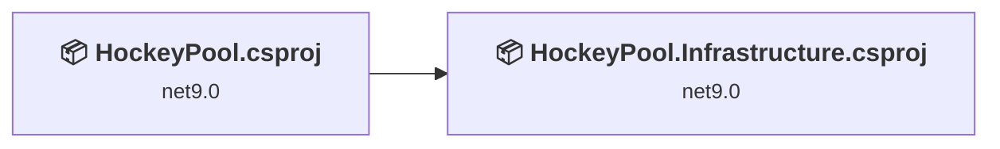
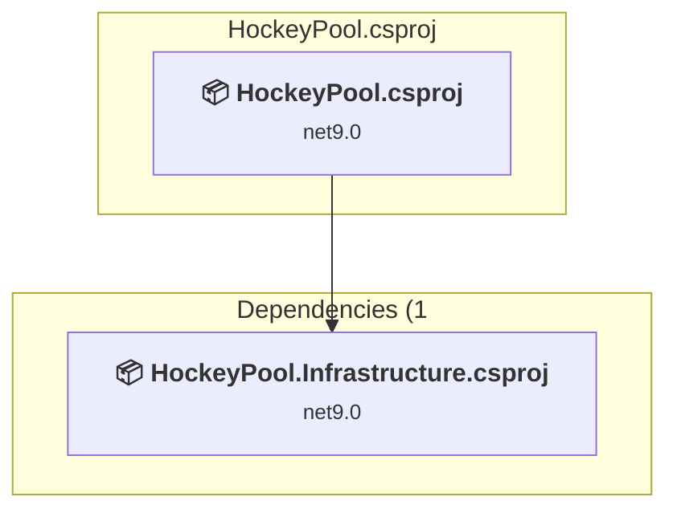
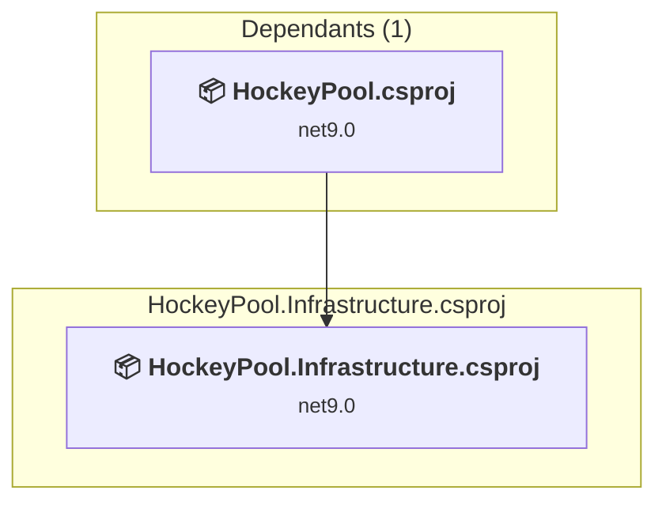

# Projects and dependencies analysis

This document provides a comprehensive overview of the projects and their dependencies in the context of upgrading to .NETCoreApp,Version=v10.0.

## Table of Contents

- [Executive Summary](#executive-Summary)
  - [Highlevel Metrics](#highlevel-metrics)
  - [Projects Compatibility](#projects-compatibility)
  - [Package Compatibility](#package-compatibility)
  - [API Compatibility](#api-compatibility)
- [Aggregate NuGet packages details](#aggregate-nuget-packages-details)
- [Top API Migration Challenges](#top-api-migration-challenges)
  - [Technologies and Features](#technologies-and-features)
  - [Most Frequent API Issues](#most-frequent-api-issues)
- [Projects Relationship Graph](#projects-relationship-graph)
- [Project Details](#project-details)

  - [HockeyPool\HockeyPool.csproj](#hockeypoolhockeypoolcsproj)
  - [Infrastructure\HockeyPool.Infrastructure.csproj](#infrastructurehockeypoolinfrastructurecsproj)

## Executive Summary

### Highlevel Metrics

| Metric | Count | Status |
| :--- | :---: | :--- |
| Total Projects | 2 | All require upgrade |
| Total NuGet Packages | 10 | 9 need upgrade |
| Total Code Files | 38 |  |
| Total Code Files with Incidents | 8 |  |
| Total Lines of Code | 3288 |  |
| Total Number of Issues | 25 |  |
| Estimated LOC to modify | 13+ | at least 0,4% of codebase |

### Projects Compatibility

| Project | Target Framework | Difficulty | Package Issues | API Issues | Est. LOC Impact | Description |
| :--- | :---: | :---: | :---: | :---: | :---: | :--- |
| [HockeyPool\HockeyPool.csproj](#hockeypoolhockeypoolcsproj) | net9.0 | 🟢 Low | 5 | 13 | 13+ | AspNetCore, Sdk Style = True |
| [Infrastructure\HockeyPool.Infrastructure.csproj](#infrastructurehockeypoolinfrastructurecsproj) | net9.0 | 🟢 Low | 5 | 0 |  | ClassLibrary, Sdk Style = True |

### Package Compatibility

| Status | Count | Percentage |
| :--- | :---: | :---: |
| ✅ Compatible | 1 | 10,0% |
| ⚠️ Incompatible | 1 | 10,0% |
| 🔄 Upgrade Recommended | 8 | 80,0% |
| ***Total NuGet Packages*** | ***10*** | ***100%*** |

### API Compatibility

| Category | Count | Impact |
| :--- | :---: | :--- |
| 🔴 Binary Incompatible | 0 | High - Require code changes |
| 🟡 Source Incompatible | 7 | Medium - Needs re-compilation and potential conflicting API error fixing |
| 🔵 Behavioral change | 6 | Low - Behavioral changes that may require testing at runtime |
| ✅ Compatible | 15896 |  |
| ***Total APIs Analyzed*** | ***15909*** |  |

## Aggregate NuGet packages details

| Package | Current Version | Suggested Version | Projects | Description |
| :--- | :---: | :---: | :--- | :--- |
| Microsoft.AspNetCore.Diagnostics.EntityFrameworkCore | 9.0.4 | 10.0.2 | [HockeyPool.csproj](#hockeypoolhockeypoolcsproj) | NuGet package upgrade is recommended |
| Microsoft.AspNetCore.Identity.EntityFrameworkCore | 9.0.4 | 10.0.2 | [HockeyPool.csproj](#hockeypoolhockeypoolcsproj) [HockeyPool.Infrastructure.csproj](#infrastructurehockeypoolinfrastructurecsproj) | NuGet package upgrade is recommended |
| Microsoft.EntityFrameworkCore.Design | 9.0.4 | 10.0.2 | [HockeyPool.csproj](#hockeypoolhockeypoolcsproj) | NuGet package upgrade is recommended |
| Microsoft.EntityFrameworkCore.Sqlite | 9.0.4 | 10.0.2 | [HockeyPool.csproj](#hockeypoolhockeypoolcsproj) | NuGet package upgrade is recommended |
| Microsoft.EntityFrameworkCore.SqlServer | 9.0.4 | 10.0.2 | [HockeyPool.Infrastructure.csproj](#infrastructurehockeypoolinfrastructurecsproj) | NuGet package upgrade is recommended |
| Microsoft.EntityFrameworkCore.Tools | 9.0.4 | 10.0.2 | [HockeyPool.Infrastructure.csproj](#infrastructurehockeypoolinfrastructurecsproj) | NuGet package upgrade is recommended |
| Microsoft.Extensions.Hosting.Abstractions | 9.0.4 | 10.0.2 | [HockeyPool.Infrastructure.csproj](#infrastructurehockeypoolinfrastructurecsproj) | NuGet package upgrade is recommended |
| Microsoft.Extensions.Identity.Stores | 9.0.4 | 10.0.2 | [HockeyPool.Infrastructure.csproj](#infrastructurehockeypoolinfrastructurecsproj) | NuGet package upgrade is recommended |
| MudBlazor | 8.6.0 |  | [HockeyPool.csproj](#hockeypoolhockeypoolcsproj) | ✅Compatible |
| SQLitePCLRaw.lib.e_sqlite3 | 2.1.11 |  | [HockeyPool.csproj](#hockeypoolhockeypoolcsproj) | ⚠️NuGet package is deprecated |

## Top API Migration Challenges

### Technologies and Features

| Technology | Issues | Percentage | Migration Path |
| :--- | :---: | :---: | :--- |

### Most Frequent API Issues

| API | Count | Percentage | Category |
| :--- | :---: | :---: | :--- |
| T:System.Uri | 4 | 30,8% | Behavioral Change |
| M:Microsoft.AspNetCore.Builder.ExceptionHandlerExtensions.UseExceptionHandler(Microsoft.AspNetCore.Builder.IApplicationBuilder,System.String,System.Boolean) | 1 | 7,7% | Behavioral Change |
| T:Microsoft.AspNetCore.Builder.MigrationsEndPointExtensions | 1 | 7,7% | Source Incompatible |
| M:Microsoft.AspNetCore.Builder.MigrationsEndPointExtensions.UseMigrationsEndPoint(Microsoft.AspNetCore.Builder.IApplicationBuilder) | 1 | 7,7% | Source Incompatible |
| T:Microsoft.Extensions.DependencyInjection.DatabaseDeveloperPageExceptionFilterServiceExtensions | 1 | 7,7% | Source Incompatible |
| M:Microsoft.Extensions.DependencyInjection.DatabaseDeveloperPageExceptionFilterServiceExtensions.AddDatabaseDeveloperPageExceptionFilter(Microsoft.Extensions.DependencyInjection.IServiceCollection) | 1 | 7,7% | Source Incompatible |
| T:Microsoft.Extensions.DependencyInjection.IdentityEntityFrameworkBuilderExtensions | 1 | 7,7% | Source Incompatible |
| M:Microsoft.Extensions.DependencyInjection.IdentityEntityFrameworkBuilderExtensions.AddEntityFrameworkStores''1(Microsoft.AspNetCore.Identity.IdentityBuilder) | 1 | 7,7% | Source Incompatible |
| P:System.Uri.AbsoluteUri | 1 | 7,7% | Behavioral Change |
| M:System.TimeSpan.FromMinutes(System.Int64) | 1 | 7,7% | Source Incompatible |

## Projects Relationship Graph

Legend:
📦 SDK-style project
⚙️ Classic project

## Project Details

### HockeyPool\HockeyPool.csproj

#### Project Info

- **Current Target Framework:** net9.0
- **Proposed Target Framework:** net10.0
- **SDK-style**: True
- **Project Kind:** AspNetCore
- **Dependencies**: 1
- **Dependants**: 0
- **Number of Files**: 76
- **Number of Files with Incidents**: 7
- **Lines of Code**: 459
- **Estimated LOC to modify**: 13+ (at least 2,8% of the project)

#### Dependency Graph

Legend:
📦 SDK-style project
⚙️ Classic project

### API Compatibility

| Category | Count | Impact |
| :--- | :---: | :--- |
| 🔴 Binary Incompatible | 0 | High - Require code changes |
| 🟡 Source Incompatible | 7 | Medium - Needs re-compilation and potential conflicting API error fixing |
| 🔵 Behavioral change | 6 | Low - Behavioral changes that may require testing at runtime |
| ✅ Compatible | 12119 |  |
| ***Total APIs Analyzed*** | ***12132*** |  |

### Infrastructure\HockeyPool.Infrastructure.csproj

#### Project Info

- **Current Target Framework:** net9.0
- **Proposed Target Framework:** net10.0
- **SDK-style**: True
- **Project Kind:** ClassLibrary
- **Dependencies**: 0
- **Dependants**: 1
- **Number of Files**: 23
- **Number of Files with Incidents**: 1
- **Lines of Code**: 2829
- **Estimated LOC to modify**: 0+ (at least 0,0% of the project)

#### Dependency Graph

Legend:
📦 SDK-style project
⚙️ Classic project

### API Compatibility

| Category | Count | Impact |
| :--- | :---: | :--- |
| 🔴 Binary Incompatible | 0 | High - Require code changes |
| 🟡 Source Incompatible | 0 | Medium - Needs re-compilation and potential conflicting API error fixing |
| 🔵 Behavioral change | 0 | Low - Behavioral changes that may require testing at runtime |
| ✅ Compatible | 3777 |  |
| ***Total APIs Analyzed*** | ***3777*** |  |

